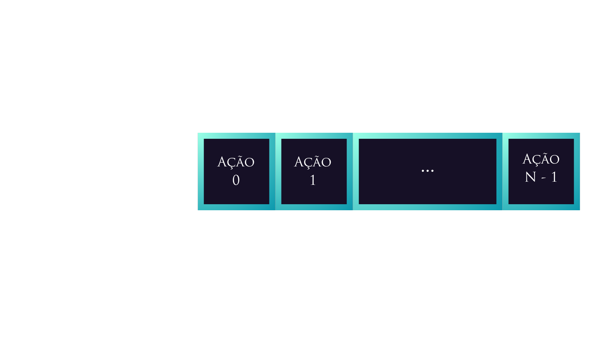
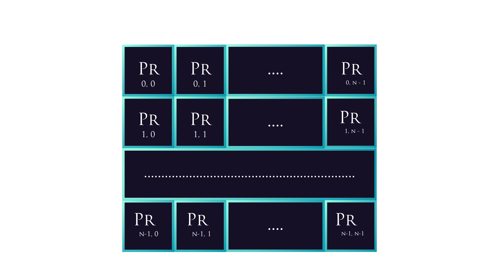
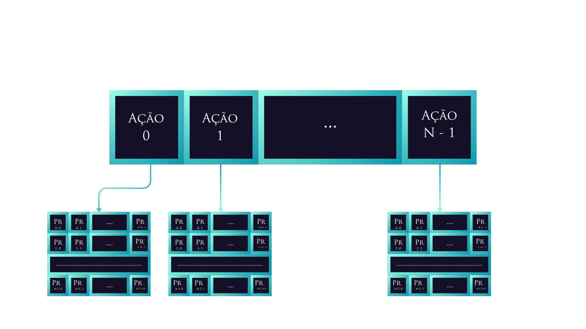

# Value Iteration - Parte 1: Python

O Value Iteration, ou Iteração de Valor, é um dos algoritmos de programação dinâmica, é utilizado para encontrar a política ótima para cada estado.

No livro "Reinforcement Learning, An Introduction", temos o seguinte pseudocódigo apresentado no capítulo 4:


Agora, como ele ficaria em código real?

Vamos começar com uma versão básica em Python.

## Quer argumentos?

Pelo que podemos observar no pseudocódigo acima, quais seriam os argumentos a serem utilizados?

Precisamos de uma taxa de desconto, que será aplicada para nossas recompensas retornadas. Logo,

```python
def value_iteration(discount_rate : float)
```

Será necessário, também, um "threshold", um limite de convergência.

O algoritmo de `Value Iteration` utiliza esse threshold, justamente, para que exista algum critério de parada. Encontrar o valor matemático exato requer um número **infinito de de iterações**.

Imagino que você não queira deixar um algorimo rodando para todo o sempre, correto?

Dessa forma, precisamos de um criério de parada que garanta uma política **"suficientemente ótima"**, ou "quase ótima", com uma redução significativa de custo computacional.

Dito isso,

```python
def value_iteration(discount_rate : float, threshold : float)
```

Também, precisaremos do nosso conjunto de ações, estados e recompensas, que é o básico para MDPs.

Poderíamos pensar em utilizar diferentes estruturas de dados, mais abstratas. Porém, para fins de sanidade e simplificação, vamos fazer com base nas listas do Python, mesmo:

```python
def value_iteration(
    discount_rate : float,
    threshold : float,
    actions : list,
    states : list,
    rewards : list
)
```

Agora, como trataremos a **função de transição** neste caso?

Ainda não temos uma maneira genérica de buscar o cálculo da **dinâmica do nosso problema**.

No momento, para fins didáticos e de simplificação, podemos tratar ela como sendo uma tabela, uma matriz, com diferentes probabilidades para diferentes tomadas de ação.

Como assim?

Em um problema, quando estamos modelando **Um Processo Markoviano de Decisão Finito**, existem um conjunto fixo de ações a serem tomadas. Com base nessas ações, transitamos entre diferentes estados, mais especificamente de um estado inicial para um estado final.

Uma ação pode te direcionar para diferentes estados. Por isso, existe a aleatoriedade aqui e o cálculo de probabilidades.

Como estruturamos isso no computador???

Podemos usar e abusar de representações vetoriais e construir **um arranjo de matrizes!**

Esse arranjo seria, basicamente, um array normal, onde **cada índice diz respeito a uma ação**.



Então, o índice zero diz respeito à ação zero, o índice um diz respeito à ação um, e por aí vai.

Beleza, decidi tomar uma ação. Quais são as possíveis consequências disso?

Depende de **qual estado você está**. Isso influencia diretamente as probabilidades de transição para quaisquer outros estados.

Uma maneira de armazenar essas probabilidades de transição é, justamente, **usufruir de uma matriz**, onde as linhas dizem respeito aos estados de partida, os iniciais, e as colunas aos estados para onde posso ir, os finais.



Os valores armazenados na combinação de cada linha/coluna são as probabilidades de **partir daquele estado inicial** e ir para **aquele final** com base na **ação escolhida**.

Assim, a nossa estrutura ficaria, conceitualmente, desse jeito:



Dito isso, precisaremos passar ela como argumento. Então:

```python
def value_iteration(
    discount_rate: float,
    threshold: float,
    actions: list,
    states: list,
    rewards: list,
    trans_func_per_action: list,
)
```

> Onde `trans_fuc_per_action` é o nosso arranjo de matrizes

## Inicializações

O algoritmo define que façamos uma inicialização de `V(s)` para **todos os estados**.

No caso, aplicaremos a Value Funcion (ou Função de Valor) para cada estado e guardaremos os resultados obtidos. Isso será importante para definir a nossa **política ótima**.

Organizaremos os valores obtidos em um vetor de valores, que estima o quão "bom" é estar em um estado (ou tomar uma ação em um estado), considerando não apenas a recompensa imediata, mas o que o agente pode ganhar no futuro.

Obviamente, cada índice será referente ao estado em questão. Então, o índice zero diz respeito ao estado zero, etc.

Um jeito bacana de realizar essa inicialização é utilizar a biblioteca `numpy`, que é excelente para, por exemplo, lidar com questões de **Álgebra Linear** em Python.

O código ficaria assim:

```python
import numpy as np

def value_iteration(
    discount_rate: float,
    threshold: float,
    actions: list,
    states: list,
    rewards: list,
    trans_func_per_action: list,
):
    # Vamos inicializar V(s) para todo estado pertencente
    # ao nosso conjunto de estados
    state_values = np.zeros(len(states))
```

O que `state_values = np.zeros()` faz é, basicamente, inicializar uma lista com **o tamanho passado como argumento** e preencher ela com zeros, o que é bem útil.

Passamos como argumento o `len(states)` para obter o tamanho correto para a lista.

Outra coisa que precisaremos inicializar, mas que não é explicitamente descrito no algoritmo é um **vetor para política ótima**, que irá armazenar as melhores decisões para cada estado:

```python
def value_iteration(
    discount_rate: float,
    threshold: float,
    actions: list,
    states: list,
    rewards: list,
    trans_func_per_action: list,
):

    # Vamos inicializar V(s) para todo estado pertencente
    # ao nosso conjunto de estados
    state_values = np.zeros(len(states))

    # Definindo lista de políticas ótimas para cada estado
    optimal_policy = np.zeros(len(states))
```

Como o Python não possui uma estrutura de loop `do while`, vamos de gambiarra. A inicialização de um `delta` maior que o `threshold` se faz necessária.

```python
def value_iteration(
    discount_rate: float,
    threshold: float,
    actions: list,
    states: list,
    rewards: list,
    trans_func_per_action: list,
):

    # Vamos inicializar V(s) para todo estado pertencente
    # ao nosso conjunto de estados
    state_values = np.zeros(len(states))

    # Definindo lista de políticas ótimas para cada estado
    optimal_policy = np.zeros(len(states))

    # Definindo um Delta maior que Threshold,
    # para que ele consiga entrar no while
    delta = threshold + 1.0
```

Finalmente, podemos entrar no **loop principal**.

## while delta > threshold e o return

Aqui vem o **grosso** do nosso algoritmo. Precisamos atribuir **zero** no `delta` e criar mais um loop!

```python
def value_iteration(
    discount_rate: float,
    threshold: float,
    actions: list,
    states: list,
    rewards: list,
    trans_func_per_action: list,
):

    # Vamos inicializar V(s) para todo estado pertencente
    # ao nosso conjunto de estados
    state_values = np.zeros(len(states))

    # Definindo lista de políticas ótimas para cada estado
    optimal_policy = np.zeros(len(states))

    # Definindo um Delta maior que Threshold,
    # para que ele consiga entrar no while
    delta = threshold + 1.0

    # Loop principal
    while delta > threshold:
        delta = 0.0 # Atribuindo

        # Para cada estado no nosso conjunto de estados:
        for single_state in states:
```

O algoritmo descrito no livro indica que façamos atribuição numa variável `v` do valor atribuído ao estado momentâneo do loop.

Isso serve para, eventualmente, realizar a subtração dentro do módulo. Já chegaremos lá.

Além disso, existem outras coisas que **não ficam muito claras no pseudocódigo**, em termos de **implementação bruta**, mas que é bom trabalharmos desde já:

**Encontrar o maior valor esperado e a ação que maximiza os valores retornados.**

Faremos, então, uma versão **"bruta"**, se baseando e **for loops**. No caso, é uma **versão iterativa**.

Em contrapartida, faremos também uma versão mais condensada, baseada na **numpy**. No caso, é uma **versão vetorial**.

### Versão Iterativa

Dentro dos nossos **Loops**, precisamos começar implementando a atribuição que mencionamos anteriormente.

Além disso, vamos encontrar a melhor ação para um estado em questão e o máximo valor esperado para atribuir no nosso vetor `state_values`.

Para isso, é preciso inicializar algumas outras variáveis na versão bruta do código. Observe:

```python
while delta > threshold:
        delta = 0.0
        for single_state in states:
            # Primeira atribuição dentro do loop
            old_value = state_values[single_state]  # v <- V(s)
            # Variável para guardar a melhor ação para um estado em questão
            best_action = actions[0]
            # Para o próximo passo, vamos inicializar max_value, que será a "pontuação máxima" para aquele estado obtida com a função valor
            max_value = -1e9
```

Precisamos aplicar, então, o cálculo do maior valor esperado para a pontuação.

Como podemos ler aquela linha em linguagem interpretável por seres humanos? Veja:

**V(s)← : "A nova nota deste estado será..."**

**MAXa : "...o melhor cenário possível. Vamos olhar todas as ações que eu posso tomar aqui e escolher apenas aquela que me der o maior lucro."**

**∑s′,r P(s′,r∣s,a) : "...mas como o mundo tem incertezas, eu preciso fazer uma média de tudo o que pode acontecer ao tomar essa ação."**

**[ r+γV(s′) ] : "...e o lucro que eu estou medindo é: a recompensa imediata que eu ganho agora (r) somada à nota do estado em que eu vou parar no futuro (V(s′)), descontada por um fator γ (discount rate) porque o futuro é incerto."**

Certo! Vamos estruturar tudo isso acima em um formato iterativo. Para isso, precisaremos de dois loops:

```python
# Rodando a Action Value Function,
# ao mesmo tempo que pegamos a ação que maximiza o
# valor retornado
for single_action in actions:
    temp = 0.0
    for single_state_apostrophe in states:
```

O comentário dentro do bloco acima já deu um spoiler. Vamos iterar por cada ação, justamente para encontrar aquela que maximiza o valor retornado.

Enquanto isso, a linha `for single_state_apostrophe in states:` diz respeito àquele somatório da função valor, que é para cada `s'`.

Continuando, o que é necessário fazer dentro do **Loop duplo**? Acompanhe:

```python
# Rodando a Action Value Function,
# ao mesmo tempo que pegamos a ação que maximiza o
# valor retornado
for single_action in actions:
    temp = 0.0
    for single_state_apostrophe in states:

        # Pegando a matriz com probabilidades de transição
        # com base na ação em questão
        matriz = trans_func_per_action[single_action]

        # Pegando a probabilidade de transição para o par
        # (s, s') em questão.
        trans_prob = matriz[int(single_state)][int(single_state_apostrophe)]

        # Condição para realizar o resto dos cálculos
        if trans_prob > 0:
            expected_value = trans_prob * (
                rewards[single_state_apostrophe]
                + (discount_rate * state_values[single_state_apostrophe])
            )

            # Realizando o somatório em si
            temp += expected_value
```

Inicialmente, vamos recuperar a probabilidade de transição `P(s′,r∣s,a)` que precisamos. Para isso, acessamos o nosso arranjo de matrizes de transição e guardamos o valor.

Depois, precisamos realizar o cálculo do valor esperado: `P(s′,r∣s,a)[r+γV(s′)]`. Então, fazemos a linha:

`expected_value = trans_prob * (rewards[single_state_apostrophe] + (discount_rate * state_value[single_state_apostrophe]))`.

E, então, para o somatório, somamos em `temp += expected_value`.

Pois é! Tudo isso apenas para aquela linha específica do pseudocódigo.

Saindo do loop `for single_state_apostrophe in states`, vamos precisar atualizar as nossas variáveis `max_value` e `best_action` com base no que resolvemos acima. Isso ocorrerá a partir da seguinte condição:

```python
# Atualizando max_value, se necessário
if temp > max_value:
    max_value = temp
    best_action = single_action
```

O valor temporário, o mais recente que pegamos, é maior do que o valor máximo anteriormente calculado? Então o valor máximo na verdade é `temp` e a melhor ação é aquela que gerou `temp`. Parece razoável?

Por fim, vamos atualizar nossas listas anteriormente inicializadas e realizar o cálculo do `delta`.

```python
# Atualizando a política ótima
optimal_policy[single_state] = best_action
# Atualizando a lista com maior valor
state_values[single_state] = max_value
# Pegando o maior valor entre os dois
delta = max(delta, abs(old_value - state_values[single_state]))
```

e, também, retornar a nossa **política ótima**. Colocarei um print apenas para que possamos ver o **vetor de V(s)** ao final.

```python
print("Valores de Estado:", state_values)
return optimal_policy
```

E, voilá! Temos a nossa versão iterativa do **Value Iteration**:

```python
def value_iteration(
    discount_rate: float,
    threshold: float,
    actions: list,
    states: list,
    rewards: list,
    trans_func_per_action: list,
):

    # Vamos inicializar V(s) para todo estado pertencente
    # ao nosso conjunto de estados
    state_values = np.zeros(len(states))

    # Definindo lista de políticas ótimas para cada estado
    optimal_policy = np.zeros(len(states))
    # Definindo um Delta maior que Threshold,
    # para que ele consiga entrar no while
    delta = threshold + 1.0

    # Loop principal
    while delta > threshold:
        delta = 0.0
        for single_state in states:
            # Primeira atribuição dentro do loop
            old_value = state_values[single_state]  # v <- V(s)
            # Variável para guardar a melhor ação para um estado em questão
            best_action = actions[0]
            # Para o próximo passo, vamos inicializar max_value
            max_value = -1e9

            # Rodando a Action Value Function,
            # ao mesmo tempo que pegamos a ação que maximiza o
            # valor retornado
            for single_action in actions:
                temp = 0.0
                for single_state_apostrophe in states:
                    # Pegando a matriz com probabilidades de transição
                    # com base na ação em questão
                    matriz = trans_func_per_action[single_action]

                    # Pegando a probabilidade de transição para o par
                    # (s, s') em questão.
                    trans_prob = matriz[int(single_state)][int(single_state_apostrophe)]
                    if trans_prob > 0:
                        expected_value = trans_prob * (
                            rewards[single_state_apostrophe]
                            + (discount_rate * state_values[single_state_apostrophe])
                        )
                        temp += expected_value
                # Atualizando max_value, se necessário
                if temp > max_value:
                    max_value = temp
                    best_action = single_action
            # Atualizando a política ótima
            optimal_policy[single_state] = best_action
            # Atualizando a lista com maior valor
            state_values[single_state] = max_value
            # Pegando o maior valor entre os dois
            delta = max(delta, abs(old_value - state_values[single_state]))
    print("Valores de Estado:", state_values)
    return optimal_policy
```

Uma dúvida que pode surgir aqui é: o somatório para o cálculo de **state value** não deveria ser para todo **s' e r**? Por que não fazemos, aqui, mais um loop para todas as recompensas?

Ótima pergunta!

A resposta está na diferença entre a Teoria Geral (que abrange qualquer problema do universo) e a Modelagem que estamos fazendo.

A fórmula usa **∑(s′,r)** porque ela foi escrita para suportar ambientes onde a recompensa é uma "roleta de cassino".

O código foi construído com uma premissa diferente (e que é a mais comum em 90% dos labirintos de IA): A recompensa é determinística e depende estritamente do estado futuro (s′).

Fizemos isso para fins didáticos e de simplificação.

Do jeito que programamos, se o agente pisa no Estado X, ele **sempre ganha a recompensa atrelada ao Estado X**. Não existe "roleta" para as moedas. A recompensa é uma função direta do estado: **R(s′)**.

Quando a recompensa é determinística e amarrada ao estado futuro, a probabilidade da recompensa ser diferente de R(s′) é zero. Matematicamente, a fórmula geral sofre uma redução automática. Ela perde a dimensão r no somatório e a probabilidade conjunta **p(s′,r∣s,a)** vira apenas a probabilidade de transição **p(s′∣s,a)**.

### Versão Vetorial

Agora, a diferença na implementação será muito nítida. A versão vetorial nos fornece um código mais condensado e legível.

Vamos nos basear, principalmente, na biblioteca `numpy`, usufruindo de todo o seu poder. Ela possui funções que contornam a necessidade de encontrar valores máximos a partir de loops com variáveis sendo comparadas em um bloco de `if`. Tudo acaba ficando bem mais parecido com o pseudocódigo que vimos no começo.

Os recursos que utilizaremos serão:

1.  _numpy.max_: retorna o valor máximo de um array ou o valor máximo em um eixo.

De acordo com a [documentação oficial da NumPy](https://numpy.org/doc/2.1/reference/generated/numpy.max.html), temos um argumento obrigatório: `a`. Mas, também comentaremos sobre `axis`.

(i) `a`: um array, que diz respeito aos dados de entrada.

(ii) `axis`: vazio, um inteiro ou uma tupla de inteiros, opcional; será o(s) eixo(s) em que vamos operar.

Se for uma tupla de inteiros, o valor máximo será selecionado em vários eixos, em vez de um único eixo ou de todos os eixos como antes.

2.  O operador `@`: utilizado para multiplicação de matrizes.

É uma abreviação para a função [numpy.matmul](https://numpy.org/doc/stable/reference/generated/numpy.matmul.html).

3. _numpy.absolute_ ou _numpy.abs_: calcula o valor absoluto elemento por elemento em uma determinada matriz ou escalar de entrada.

De acordo com a [documentação oficial da NumPy](https://numpy.org/doc/stable/reference/generated/numpy.absolute.html), temos um argumento obrigatório: `x`, que é o array de input.

Ok! Partindo para a implementação, começaremos preparando os nossos dados:

```python
def value_iteration_vetorial(
    discount_rate: float,
    threshold: float,
    actions: list,
    states: list,
    rewards: list,
    trans_func_per_action: list,
):
    # Preparação dos Dados
    # P vira uma Matriz 3D no formato: (Ações, Estados Atuais, Estados Futuros)
    trans_func_per_action_numpy = np.array(trans_func_per_action)

    # Converte a nossa lista de recompensas para um array
    # da NumPy
    rewards_numpy = np.array(rewards)

    # Inicializando nossos state_values e optimal_policy do mesmo jeito
    state_values = np.zeros(len(states))
    optimal_policy = np.zeros(len(states))
```

Aqui, fizemos algumas alterações. Convertemos algumas das nossas listas passadas como parâmetro. Essas passarão por operações de álgebra linear, então é importante que estejam dentro dos conformes da **NumPy**.

Vamos, então para dentro do nosso **loop principal**:

```python
delta = threshold + 1.0
# Loop principal de convergência
while delta > threshold:
    # EQUAÇÃO DE BELLMAN EM 2 LINHAS
    # Passo 1: Calcula o [ R(s') + gama * V(s') ] para todos os estados de uma vez
    v_target = rewards_numpy + (discount_rate * state_values)

    # Passo 2: O Somatório de Bellman!
    expected_value = trans_func_per_action_numpy @ v_target
```

Sim, as duas linhas que colocamos dentro do while já fazem boa parte do que quebramos a cabeça fazendo anteriormente. Esse é o poder da `NumPy` e da `Álgebra Linear`:

1. O operador '@' multiplica a matriz 3D 'trans_func_per_action_numpy' pelo vetor 'v_target'.
2. O NumPy faz a soma das probabilidades automaticamente e devolve 'expected_value', uma matriz onde as linhas são as Ações e as colunas são os Estados.

Vamos agora extrair a política e os valores:

```python
# Pega a "nota" da melhor ação para cada estado (axis=0 olha pelas linhas/ações)
new_V = np.max(expected_value, axis=0)

# Pega o "índice" (o número) da melhor ação para cada estado
optimal_policy = np.argmax(expected_value, axis=0)

# Atualiza o delta checando a maior diferença de V(s) do tabuleiro inteiro
delta = np.max(np.abs(new_V - state_values))

# Salva as notas para o próximo loop
state_values = new_V
```

Por fim, basta retornar a nossa política ótima. A nossa função completa fica assim:

```python
def value_iteration_vetorial(
    discount_rate: float,
    threshold: float,
    actions: list,
    states: list,
    rewards: list,
    trans_func_per_action: list,
):
    # Preparação dos Dados
    # P vira uma Matriz 3D no formato: (Ações, Estados Atuais, Estados Futuros)
    trans_func_per_action_numpy = np.array(trans_func_per_action)

    # Converte a nossa lista de recompensas para um array
    # da NumPy
    rewards_numpy = np.array(rewards)

    # Inicializando nossos state_values e optimal_policy do mesmo jeito
    state_values = np.zeros(len(states))
    optimal_policy = np.zeros(len(states))

    delta = threshold + 1.0

    # Loop principal de convergência
    delta = threshold + 1.0
    # Loop principal de convergência
    while delta > threshold:
        # EQUAÇÃO DE BELLMAN EM 2 LINHAS
        # Passo 1: Calcula o [ R(s') + gama * V(s') ] para todos os estados de uma vez
        v_target = rewards_numpy + (discount_rate * state_values)

        # Passo 2: O Somatório de Bellman!
        expected_value = trans_func_per_action_numpy @ v_target

        # --- EXTRAINDO A POLÍTICA E OS VALORES ---

        # Pega a "nota" da melhor ação para cada estado (axis=0 olha pelas linhas/ações)
        new_V = np.max(expected_value, axis=0)

        # Pega o "índice" (o número) da melhor ação para cada estado
        optimal_policy = np.argmax(expected_value, axis=0)

        # Atualiza o delta checando a maior diferença de V(s) do tabuleiro inteiro
        delta = np.max(np.abs(new_V - state_values))

        # Salva as notas para o próximo loop
        state_values = new_V

    print(f"Valores dos Estados V(s):\n{state_values}")
    return optimal_policy
```

Finalmente, temos a nossa versão vetorial da `Value Iteration`. Perceba como ela fica muito mais enxuta. Além disso, também fica otimizada, pois existe o motor em C rodando por baixo dos panos na `NumPy`.
